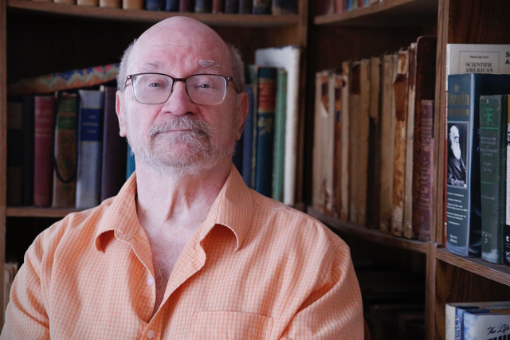

---
# Feel free to add content and custom Front Matter to this file.
# To modify the layout, see https://jekyllrb.com/docs/themes/#overriding-theme-defaults

layout: default
---
<section markdown=1>
<figure markdown=1>

<figcaption>Donald Skoog – Writer Composer Speaker</figcaption>
</figure>

Don Skoog is an independent composer, writer, speaker, percussionist, and multimedia artist who performs on Latin and Arabic percussion, marimba, vibraphone, drumset, and flamenco cajón. He is Director of The Dickinson Ensemble, a chamber group that composes, commissions, and performs music based on the poetry of Emily Dickinson.

His compositions include Emily Sings, a chamber suite for soprano, flute, cello, and piano, performed by The Dickinson Ensemble at the Emily Dickinson International Society (EDIS) Annual Meeting in 2024—three marimba trio works Attendance to Ritual, Art Song, and Mozambique republished in 2023 by Mostly Marimba, Inc.—La Cantilena de las Luces for percussion ensemble, commissioned by Millikin University, performed there in 2018, published by CMP Press—and his composition Water and Fire for solo marimba won 2nd Prize in the Percussive Arts Society’s 1982 Composition Contest, published by Mostly Marimba, Inc.

He has published books and magazine articles in English and Arabic, authoring  Batá Drumming; The Instruments, the Rhythms, and the People Who Play Them, published by CMP Press. He presented the paper, Making Emily Sing at the American Literature Association’s 2024 Annual Meeting. He presented the paper, Music and Meaning and hosted a music and poetry workshop, Ecologies of Song, at the EDIS International Convention in Taipei in June, 2025. He is co-chair of the EDIS Arts Committee.

He has given talks, demonstrations, and clinics at the University of Wisconsin (Madison and Milwaukee), Northwestern University, Valparaiso University, Vandercook College, Kansas State University, Colorado State University, Illinois Wesleyen University, the Nashville Jazz Workshop, Millikin University, College of DuPage, Concordia University, and the PAS Illinois Day of Percussion, as well as hundreds of presentations in grade- and high-schools through Classical Music Chicago, and has presented many library shows on Jazz, Flamenco, Latin, and Arabic music.

He was lead artist for the Gallery 37 Latin Big Band from 1993 to 2002, has taught percussion at the American Conservatory of Music, Sherwood Music School, and the Contemporary Music Project, which he founded in 1982, and has conducted many educational tours to Cuba, Puerto Rico, Morocco, Mexico, and Colombia.

</section>
